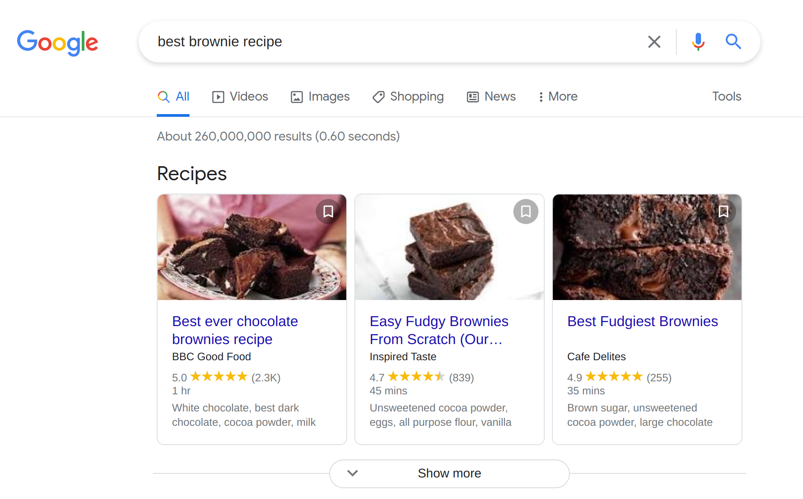
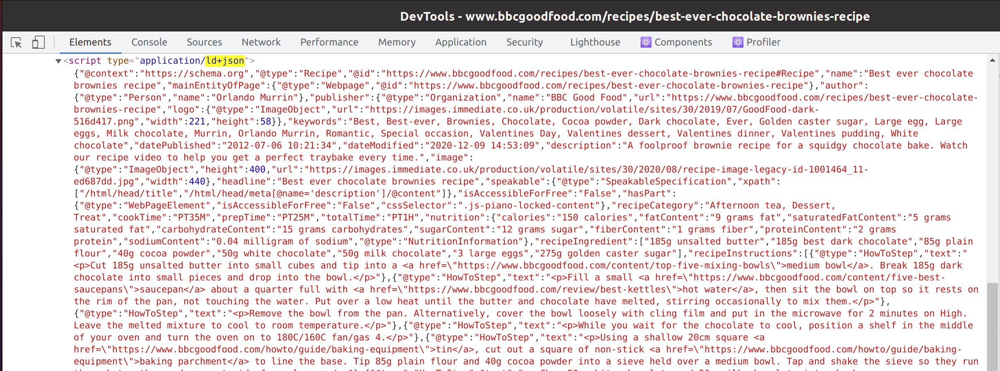
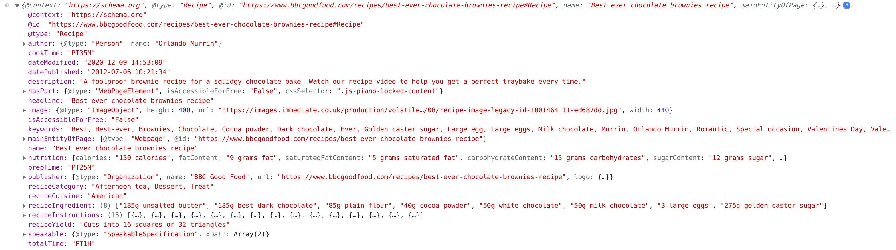

# Structured data, SEO and React

People being able to discover your website when they search is important. This post is about how you can add structured data to a site. Adding structured data will help search engines like Google understand your content, and get it in front of more eyeballs. We'll illustrate this by making a simple React app which incorporates structured data.

## What is structured data?

Google, DuckDuckGo and others are proficient at understanding the content of websites. However, scraping HTML is not a highly reliable way to categorise content. HTML is about presentation and it can have all manner of different structures. To make the life of search engines easier, there's a standardized format known as "structured data" which can be embedded within a page. That standardized format allows you to explicitly declare the type of content the page contains.

So let's say you've written an article, you can reliably state in a language that Google understands "this page is an article, it has this title, this description and image and was publised on this date". There are hundreds of types of structured data available, and you can read about all of them in depth at https://schema.org/ which is maintained by representatives of the search engine community.

It's worth knowing that whilst there are many types of structured data available to choose from, there are definitely more popular options and those that are more niche. So [Article](https://schema.org/Article) is likely to be used a great deal more than say [MolecularEntity](https://schema.org/MolecularEntity).

As well as there being different types of structured data, there also a variety of formats which can be used to provide it; these include [JSON-LD](http://json-ld.org/), [Microdata](https://www.w3.org/TR/microdata/) and [RDFa](https://rdfa.info/). Google explicitly prefer JSON-LD and so that's what we'll focus on. JSON-LD is effectively a rending of a piece of JSON inside a `script` tag with the custom type of `application/ld+json`.  For example: 

```html
<script type="application/ld+json">
{
    "@context": "https://schema.org/",
    "@type": "Recipe",
    "name": "Chocolate Brownie",
    "author": {
        "@type": "Person",
        "name": "John Reilly"
    },
    "datePublished": "2014-09-01",
    "description": "The most amazing chocolate brownie recipe",
    "prepTime": "PT60M"
}
</script>
```

## Structured data in action

Whilst structured data is helpful for search engines in general, it can also make a difference to the way your content is rendered *inside* search results. For instance, let's search for "best brownie recipe" in Google and see what shows up:



When you look at the screenshot above, you'll notice that at the top of the list (before the main search results) there's a carousel which shows various brownie recipe links, with dedicated pictures, titles and descriptions. Where did this come from? The answer, unsurprisingly, is structured data.

If we click on the first link, we're taken to the recipe in question. Looking at the HTML of that page we find a number of JSON-LD sections:



If we grab the content of one JSON-LD section and paste it into the devtools console, it becomes much easier to read:



If you look at the `headline` property above you'll see it is `"Best ever chocolate brownies recipe"` and that matches up with headline displayed in the search results. Now we have a sense of what the various search engines are using as they categorise the page, and we understand exactly what is powering the carousel in the Google search results.

Incidentally, there's a special name for this "carousel"; it i a "rich result". A rich result is a search result singled out for special treatment when displaying results.  Google provide a [Rich Results Test tool](https://search.google.com/test/rich-results) which allows you to validate if a site provides structured data which is eligible to be featured in rich results.  We'll make use of this later.

## Adding structured data to a website

Google do a good job of demostrating 

https://developers.google.com/search/docs/advanced/structured-data/search-gallery

https://github.com/facebook/docusaurus/pull/5322

https://search.google.com/test/rich-results

Structured data is a standardized format for providing information about a page and classifying the page content; for example, on a recipe page, what are the ingredients, the cooking time and temperature, the calories, and so on.

A way to improve the discoverability of a website is through SEO (Search Engine Optimization). This post is about an aspect of that called structured


There's a particular  
a blog post on Structured Data, SEO and React
