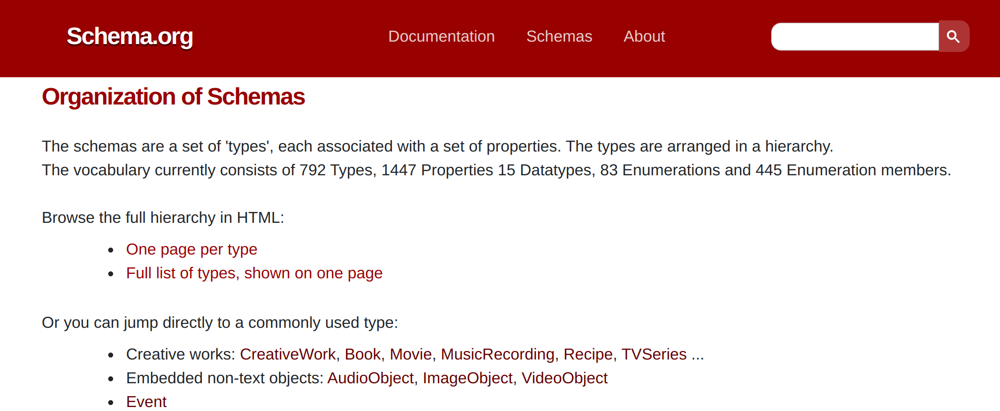
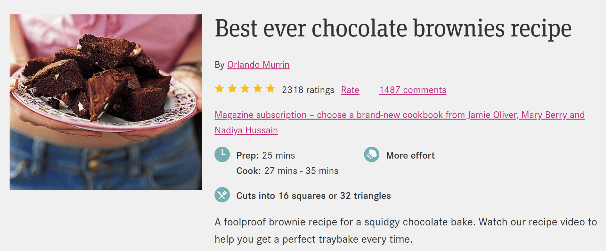

<!-- .slide: data-transition="slide" data-background="./images/faded-rich-results.png"  -->
## React, structured data, and SEO
### [LogRocket](https://www.logrocket.com) with [@johnny_reilly](https://twitter.com/johnny_reilly)

<aside class="notes">
talk to be delivered using VS Code Reveal extension: https://github.com/evilz/vscode-reveal
150% zoom for playground
general welcome
</aside>

---

<!-- .slide: data-transition="slide" data-background="./images/typescript-4-4-more-readable-code.png" -->
## `whoami`

- [@johnny_reilly](https://twitter.com/johnny_reilly) ❤️🌻

- Blogging and open-source software

- [contributed initial structured data support to Docusaurus](https://github.com/facebook/docusaurus/pull/5322)

- TypeScript: DefinitelyTyped / ts-loader etc

<aside class="notes">
Hi everyone,

My name is John Reilly and I'm a big fan of TypeScript.

Structured data
</aside>

---

<aside class="notes">
Google for "best brownie recipe"

This looks remarkably.... structured!
</aside>

## How does this work?


---

<aside class="notes">
Ranking in search results matters
Structured data is a way to help google understand your content
This will get it in front of more eyeballs
We'll look at what Structured Data is, and build a simple React app with it
</aside>

## Structured data:
## speaking the secret language of Google

---

<aside class="notes">
there's many official schemas
maintained by search engine folk
</aside>

## [Schema.org](https://schema.org)



---

<aside class="notes">
various formats - we'll look at JSON-LD
they all live tucked away in your HTML
</aside>

## Three formats

- [Microdata](https://en.wikipedia.org/wiki/Microdata_(HTML))
- [RDFa](https://en.wikipedia.org/wiki/RDFa)
- [JSON-LD](https://en.wikipedia.org/wiki/JSON-LD) * ([Google's fave](https://www.searchenginejournal.com/google-structured-data-preference/297479/))

---

## JSON-LD

```html
<script type="application/ld+json">
{
    "@context": "https://schema.org/",
    "@type": "Recipe",
    "name": "Chocolate Brownie",
    "author": {
        "@type": "Person",
        "name": "John Reilly"
    },
    "datePublished": "2014-09-01",
    "description": "The most amazing chocolate brownie recipe",
    "prepTime": "PT60M"
}
</script>
```

---

<aside class="notes">
Google for "best brownie recipe"
</aside>

### Structured data in action

<aside class="notes">
powered by structured data.
</aside>


---



https://www.bbcgoodfood.com/recipes/best-ever-chocolate-brownies-recipe

---

### Brownie source

<aside class="notes">
If we click on the first link, we're taken to the recipe in question. Looking at the HTML of that page we find a number of JSON-LD sections:
</aside>


---

### Brownie source

<aside class="notes">
look at the `@type` property we can see it's a `"Recipe"`
</aside>


https://schema.org/Recipe

---

<aside class="notes">
Google have first class support
for certain structured data
</aside>

## Rich Results:
#### how Google uses structured data

https://developers.google.com/search/docs/advanced/structured-data/search-gallery

---

## Rich Results Test

https://search.google.com/test/rich-results

---

<aside class="notes">
When I wrote the original blog post
I took a create-react-app
and added structured data
</aside>

## React: add structured data support

[](https://johnnyreilly.github.io/structured-data-seo-and-react/)

---

<aside class="notes">
When I wrote the original blog post
I took a create-react-app
and added structured data
</aside>

## view source

https://github.dev/johnnyreilly/structured-data-seo-and-react

---

## The convent with structured data

<aside class="notes">
What about a real website?
I have an aunt that's a nun...
Show rich results for the convent
</aside>

- https://www.poorclaresarundel.org/
- [PR to add initial structured data](https://github.com/johnnyreilly/poor-clares-arundel-koa/pull/57)
- [PR to add events structured data](https://github.com/johnnyreilly/poor-clares-arundel-koa/pull/58)

---

### Links

- [Original blog post](https://blog.logrocket.com/react-structured-data-and-seo/)

- [PR with initial structure data support to Docusaurus](https://github.com/facebook/docusaurus/pull/5322)

- [Rich Results Test](https://search.google.com/test/rich-results)

- [How Google uses structured data](https://developers.google.com/search/docs/advanced/structured-data/search-gallery)